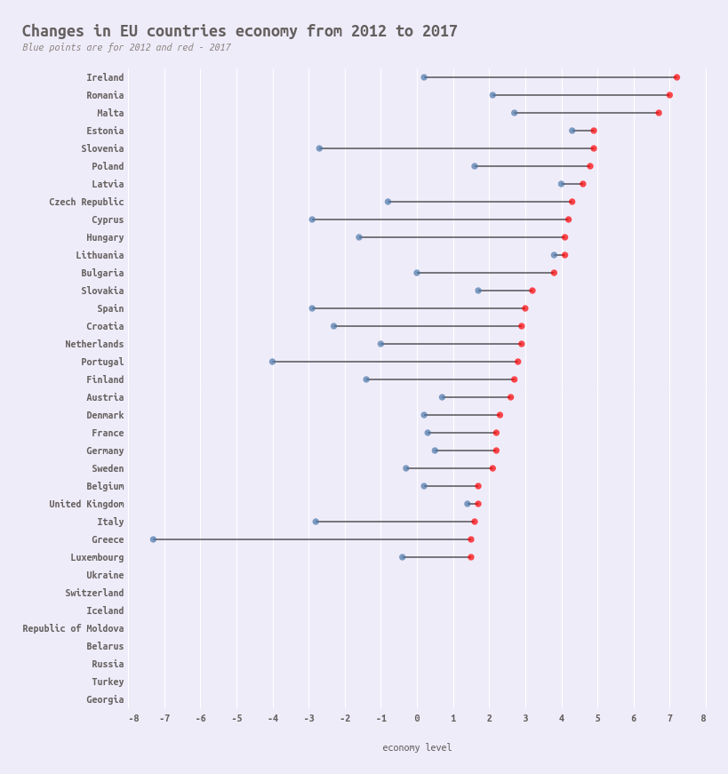
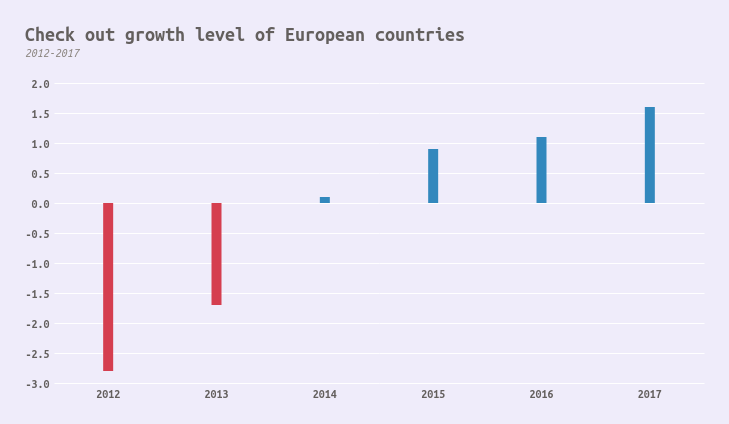
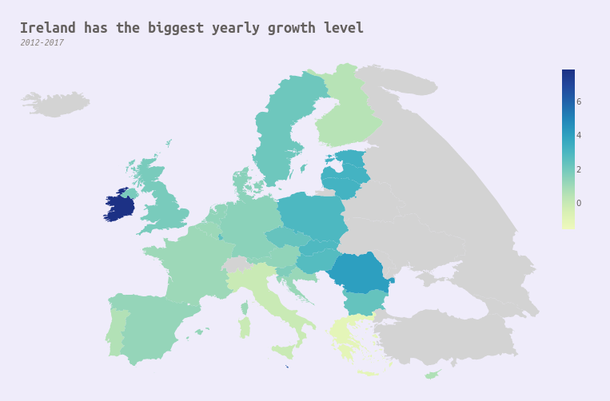

# Visualizing Europe Economy data using Altair

Created 3 visualizations:
* How economy level changed in Europe from 2012 to 2017

* Comparing growth level of European countries

* Economy changes for every country separately (interactive, example for Italy below)

Data source - https://www.kaggle.com/beradabhishek/europe-economy
